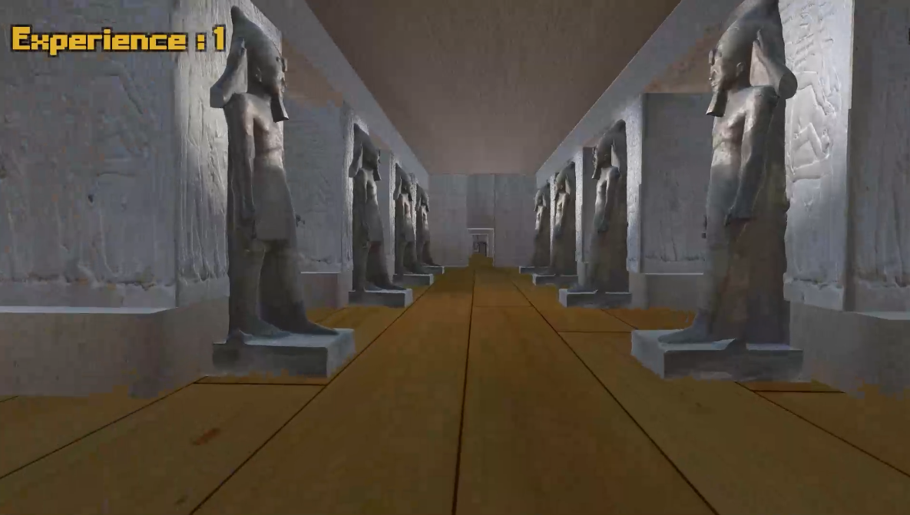

# VR Abu Simbel Temple Experience

This Unity project, developed with 3ds Max, provides a Virtual Reality (VR) environment that simulates the historical Abu Simbel Temple of Egypt. The project aims to offer users an immersive experience, allowing them to virtually visit the temple and explore its architecture and historical significance. The VR environment includes a complete tour guide that displays information about each object in the temple when interacted with.

## Features

- **Virtual Tour:** Experience a virtual tour of the Abu Simbel Temple with a realistic 3D model created using 3ds Max.

- **Interactivity:** Interact with the environment by pressing on objects to access detailed information about each element in the temple.

- **Educational Content:** Learn about the historical and cultural significance of the Abu Simbel Temple through informative descriptions and visuals.

- **Immersive Experience:** Utilize Unity's VR capabilities to create an immersive and engaging experience for users.

## Demo Video

Watch a demo of the VR Abu Simbel Temple Experience in action! Click the image above to view the video.

## Development Tools

- Unity
- 3ds Max

## Credits

- Ziad Abdelrehim Othman

